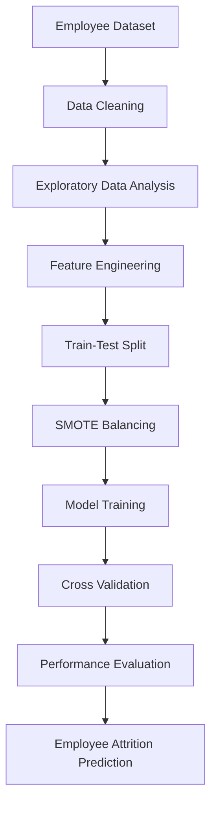
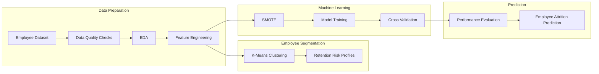

# 👥 Employee Turnover Analytics Pipeline

An end-to-end **HR Analytics** and **Machine Learning** project focused on predicting employee attrition and identifying the key factors that influence workforce turnover. The project combines **Exploratory Data Analysis (EDA)**, **unsupervised learning**, **class imbalance handling**, and **supervised machine learning** to provide actionable insights that support employee retention strategies.

---

# 📌 Project Overview

Employee attrition is one of the most significant challenges organizations face, leading to increased recruitment costs, productivity loss, and knowledge gaps.

This project develops a predictive analytics pipeline that helps organizations:

- Predict employee attrition
- Identify high-risk employees
- Discover hidden workforce segments
- Understand the primary drivers of turnover
- Support HR decision-making through data-driven insights

---

# 🎯 Objectives

- Analyze employee behavior and satisfaction patterns.
- Identify the major factors contributing to employee turnover.
- Segment employees into meaningful risk profiles.
- Handle class imbalance effectively.
- Build and compare multiple machine learning models.
- Evaluate models using robust validation techniques.

---

# 📊 Dataset

The project uses an HR Analytics dataset containing **14,999 employee records**.

### Dataset Characteristics

| Attribute | Description |
|------------|-------------|
| Records | 14,999 Employees |
| Features | 10 HR & Performance Variables |
| Target Variable | `left` |
| Problem Type | Binary Classification |

### Target Variable

| Value | Meaning |
|--------|---------|
| **0** | Employee Stayed |
| **1** | Employee Left |

---

# 🛠️ Tech Stack

### Programming

- Python

### Data Analysis

- Pandas
- NumPy

### Data Visualization

- Matplotlib
- Seaborn

### Machine Learning

- Scikit-learn
- Imbalanced-learn (SMOTE)

### Unsupervised Learning

- K-Means Clustering

---

# 📂 Project Workflow

## 1️⃣ Data Auditing & Quality Assessment

The project begins with a comprehensive audit of the HR dataset.

### Tasks Performed

- Loaded employee records
- Checked for missing values
- Verified data quality
- Examined feature distributions
- Assessed target class imbalance

### Key Finding

Approximately **23.8%** of employees had left the organization, indicating a moderately imbalanced classification problem.

---

## 2️⃣ Exploratory Data Analysis (EDA)

EDA was conducted to understand employee behavior and uncover patterns associated with attrition.

### Analysis Included

- Employee Satisfaction Distribution
- Performance Evaluation Analysis
- Average Monthly Hours
- Project Allocation
- Salary Distribution
- Department-wise Attrition
- Correlation Heatmap
- Feature Relationships

---

# 📈 Key Business Insights

## 😊 Employee Satisfaction

Employees with lower satisfaction scores showed a significantly higher likelihood of leaving the organization.

---

## 📊 Performance Evaluation

High-performing employees were not always retained, suggesting that performance alone does not guarantee employee retention.

---

## ⏰ Workload Analysis

A non-linear relationship was observed between workload and attrition.

### Key Insight

Employees assigned:

- **2 projects**
- **5 or more projects**

experienced substantially higher turnover rates.

Employees managing **3–4 projects** demonstrated the highest retention levels.

---

# 👥 Employee Segmentation (K-Means Clustering)

To better understand employees who left the organization, K-Means clustering was applied using:

- Satisfaction Level
- Last Evaluation Score

### Number of Clusters

**K = 3**

### Cluster Profiles

| Cluster | Characteristics |
|----------|----------------|
| **Cluster 0** | Moderate satisfaction with average performance |
| **Cluster 1** | Highly satisfied, high-performing employees who still left |
| **Cluster 2** | Burned-out employees with excellent evaluations but very low satisfaction |

This segmentation provides valuable insights for designing targeted employee retention strategies.

---

# ⚙️ Data Preprocessing

Several preprocessing techniques were applied before model training.

### Steps Included

- One-Hot Encoding
- Feature Selection
- Train-Test Split (80:20)
- Stratified Sampling
- Feature Preparation

---

# ⚖️ Handling Class Imbalance

Since employee attrition represented a minority class, **SMOTE (Synthetic Minority Over-sampling Technique)** was applied exclusively to the training dataset.

### Benefits

- Balanced class distribution
- Reduced prediction bias
- Prevented data leakage
- Improved minority class recall

---

# 🤖 Machine Learning Models

Three supervised learning models were developed and compared.

### Models Evaluated

- Logistic Regression
- Random Forest Classifier
- Gradient Boosting Classifier

---

# 🔄 Model Development Pipeline



---

# 🧩 Complete Analytics Pipeline



---

# 📊 Model Evaluation

To ensure reliable model performance, a **5-Fold Stratified Cross-Validation** framework was implemented.

### Evaluation Metrics

- Accuracy
- Precision
- Recall
- F1-Score
- ROC-AUC
- Confusion Matrix
- Classification Report

This evaluation strategy provides a more robust estimate of model performance compared to a single train-test split.

---

# 📁 Repository Structure

```text
employee-turnover-analytics/

│── Employee_Turnover_Analytics.ipynb
│── README.md
```

---

# 🚀 Getting Started

## Clone the Repository

```bash
git clone https://github.com/<your-username>/employee-turnover-analytics.git

cd employee-turnover-analytics
```

---

# 💼 Business Impact

This project demonstrates how HR analytics can support organizational decision-making by:

- Identifying employees at high risk of leaving
- Understanding workforce behavior
- Improving employee retention strategies
- Reducing recruitment and replacement costs
- Supporting proactive HR interventions

---

# 📌 Skills Demonstrated

- HR Analytics
- Exploratory Data Analysis (EDA)
- Data Visualization
- Feature Engineering
- Employee Segmentation
- K-Means Clustering
- Class Imbalance Handling (SMOTE)
- Machine Learning
- Classification Modeling
- Cross Validation
- Model Evaluation
- Business Insights

---

# 🚀 Future Improvements

- XGBoost & LightGBM Comparison
- Hyperparameter Optimization
- SHAP Explainability
- Employee Attrition Dashboard (Power BI)
- Streamlit Web Application
- MLflow Experiment Tracking
- Employee Retention Recommendation Engine

---

# 📫 Contact

**Arun Kumar**

📧 Email: arunkumarpremsai@gmail.com

💼 LinkedIn: https://linkedin.com/in/arunkumarpremsai

---

# ⭐ Support

If you found this project useful, consider giving the repository a **⭐ Star**.

Feedback, suggestions, and collaboration opportunities are always welcome!

---

> **"Using data and machine learning to understand workforce behavior and support smarter employee retention strategies."**
````
